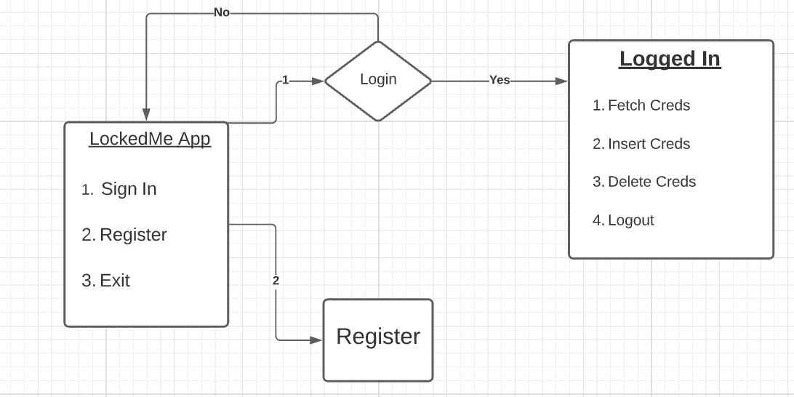
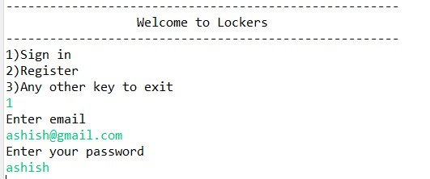
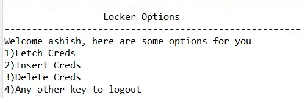
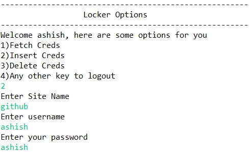
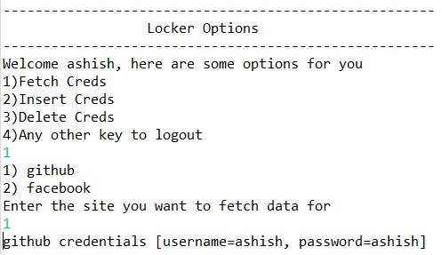

->  1. Locked Me 
---
	1.1  Project Description
		1.1.2 Tech stack:	
			-> Java
			-> File Handling
			-> Data Structures
			-> Exception Handling
			-> Serialization
			-> Deserialization
---
		
-> 2. Process Flow Chart
---

---

-> 2. Project Users Stories : ( Agile and Scrum )
---

	1. As a user I want lockers digital locker so that i can store my credentials.
	2. As a user I want registration page so that i can access lockers app.
	3. As a user I want login page to authenticate a user to access lockers app.
	4. As a dev I want build registration page to enter user in system.
	5. As a dev I want to build login page so that we can authenticate user.
	6. As a dev create user interaction with console input.

---

Sprint 1 (3 days)

	1. As a user i want lockme digital locker so that i can store my credntials.
	2. As a user i want registration page so that i can access lockme app.
	3. As a dev I want build registration page to enter user in system.
	
Sprint 2 (4 days)
	3. As a user i want login page to authnticate a user to acccess lockme app.
	4. As a dev I want to build login page so that we can authticate user.
	5. As a dev create user interaction with console input.
	
---

->3. Project git Repositories -> 
	1. link : https://github.com/ashishav7/lockedMe.git
	2. clone git : git clone https://github.com/ashishav7/lockedMe.git
	

->4. How to run poject:
	
	4.1. clone project
		clone git : git clone https://github.com/ashishav7/lockedMe.git
	4.2. open src->com->lockers->main-> MainClass.java
		-> right click  -> run as java application

-> Source code files

	MainClass.java
	LoggedIn.java
	Serialization.java
	Deserialization.java
	Credentials.java
	User.java
	-----

5. Some Output Screenshots
	
	**Home Screen**
	---
	
	---
	
	**Logged In Screen**
	---
	
	---
	
	**Insert Credentials**
	---
	
	---
	
	**Fetch Credentials**
	---
	
	---
